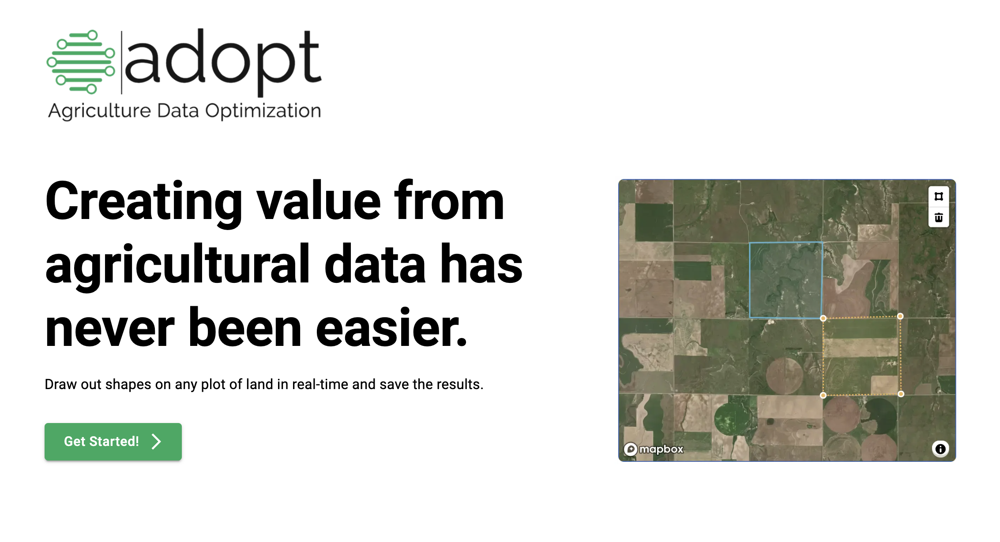

## Adopt-Ag Mapbox Demo

A self-contained project to demonstrate how [mapbox-gl-draw](https://github.com/mapbox/mapbox-gl-draw) could be used by someone in the agricultural industry. In this example, a GeoJSON file of the drawn polygons is saved locally and can be accessed by the client via a Save History component.

Focus was placed on designing a simple UI that would dynamically render for mobile, tablet, and desktop user. The API used to save and retrieve mapbox polygons provides an easy way for the client to display success and error notifications. Below are screenshots of the landing page and the main mapbox page.

This project was built using [NextJS](https://nextjs.org/) and [Material UI](https://mui.com/).




## Getting Started

First, add the environment variables in an `.env.local` file:

```bash
# Contact me for the actual token
MAPBOX_GL_ACCESS_TOKEN=<token>
```

Then run the development server:

```bash
# use the specified Node version
nvm use
# run a local version of the site
npm run dev
```

Open [http://localhost:3000](http://localhost:3000) with your browser to see the result.
